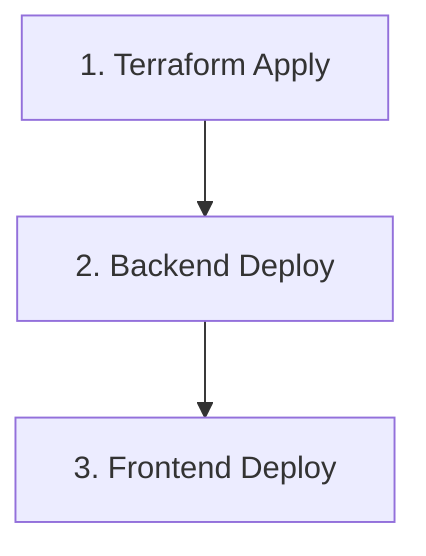

# GitHub Actions for Journaly Deployment

このディレクトリにはJournalyアプリケーションをAWSにデプロイするためのGitHub Actionsワークフローが含まれています。

## ワークフロー一覧

| ワークフロー | ファイル | 説明 |
|------------|---------|------|
| 🏗️ Deploy Infrastructure | `deploy-terraform.yml` | Terraformでインフラをデプロイ |
| 🔧 Deploy Backend | `deploy-backend.yml` | バックエンドをECSにデプロイ |
| 🎨 Deploy Frontend | `deploy-frontend.yml` | フロントエンドをS3+CloudFrontにデプロイ |

## 事前準備

### 1. AWS IAMロールの作成

GitHub ActionsからAWSリソースにアクセスするため、OIDC認証を使用したIAMロールを作成します。

```bash
# IAMロールの作成（Terraformで自動化することも可能）
aws iam create-role \
  --role-name GitHubActionsDeployRole \
  --assume-role-policy-document '{
    "Version": "2012-10-17",
    "Statement": [
      {
        "Effect": "Allow",
        "Principal": {
          "Federated": "arn:aws:iam::YOUR_ACCOUNT_ID:oidc-provider/token.actions.githubusercontent.com"
        },
        "Action": "sts:AssumeRoleWithWebIdentity",
        "Condition": {
          "StringEquals": {
            "token.actions.githubusercontent.com:aud": "sts.amazonaws.com"
          },
          "StringLike": {
            "token.actions.githubusercontent.com:sub": "repo:YOUR_GITHUB_ORG/YOUR_REPO:*"
          }
        }
      }
    ]
  }'
```

必要な権限をアタッチ：
- `AdministratorAccess`（開発環境）または必要最小限の権限
- ECR、ECS、S3、CloudFront、RDSなどへのアクセス

### 2. GitHub Secretsの設定

リポジトリの Settings → Secrets and variables → Actions で以下を設定：

#### Repository Secrets

| Secret Name | 説明 | 例 |
|------------|------|-----|
| `AWS_ROLE_ARN` | GitHubActionsが使用するAWS IAMロールのARN | `arn:aws:iam::123456789012:role/GitHubActionsDeployRole` |

#### Environment Secrets

環境ごと（`dev`, `prod`）に設定する場合は、Settings → Environments で環境を作成し、以下を設定：

| Secret Name | 説明 |
|------------|------|
| `AWS_ROLE_ARN` | 環境固有のIAMロールARN（オプション） |

### 3. Terraformバックエンドの設定（推奨）

Terraformのstateファイルをリモートで管理するため、S3バケットとDynamoDBテーブルを作成：

```bash
# S3バケットの作成
aws s3 mb s3://journaly-terraform-state --region ap-northeast-1

# バージョニングを有効化
aws s3api put-bucket-versioning \
  --bucket journaly-terraform-state \
  --versioning-configuration Status=Enabled

# 暗号化を有効化
aws s3api put-bucket-encryption \
  --bucket journaly-terraform-state \
  --server-side-encryption-configuration '{
    "Rules": [{
      "ApplyServerSideEncryptionByDefault": {
        "SSEAlgorithm": "AES256"
      }
    }]
  }'

# DynamoDBテーブルの作成（ロック用）
aws dynamodb create-table \
  --table-name terraform-state-lock \
  --attribute-definitions AttributeName=LockID,AttributeType=S \
  --key-schema AttributeName=LockID,KeyType=HASH \
  --billing-mode PAY_PER_REQUEST \
  --region ap-northeast-1
```

`terraform/provider.tf` でバックエンド設定のコメントを外す：

```hcl
backend "s3" {
  bucket         = "journaly-terraform-state"
  key            = "prod/terraform.tfstate"
  region         = "ap-northeast-1"
  encrypt        = true
  dynamodb_table = "terraform-state-lock"
}
```

## 使い方

### 🏗️ インフラのデプロイ (Terraform)

#### 手動実行

1. GitHub リポジトリの **Actions** タブに移動
2. **Deploy Infrastructure (Terraform)** を選択
3. **Run workflow** をクリック
4. 環境とアクションを選択：
   - **Environment**: `dev` または `prod`
   - **Action**: `plan`, `apply`, または `destroy`
5. **Run workflow** をクリック

#### 自動実行

`terraform/` ディレクトリ内のファイルが変更されると、`main` ブランチへのpush時に自動で `plan` が実行されます。

```bash
git add terraform/
git commit -m "Update infrastructure"
git push origin main
```

### 🔧 バックエンドのデプロイ

#### 手動実行

1. GitHub リポジトリの **Actions** タブに移動
2. **Deploy Backend to ECS** を選択
3. **Run workflow** をクリック
4. 環境を選択：`dev` または `prod`
5. **Run workflow** をクリック

#### 自動実行

`journaly-backend/` ディレクトリ内のファイルが変更されると、`main` ブランチへのpush時に自動でデプロイされます。

```bash
git add journaly-backend/
git commit -m "Update backend code"
git push origin main
```

### 🎨 フロントエンドのデプロイ

#### 手動実行

1. GitHub リポジトリの **Actions** タブに移動
2. **Deploy Frontend to S3 + CloudFront** を選択
3. **Run workflow** をクリック
4. 環境を選択：`dev` または `prod`
5. **Run workflow** をクリック

#### 自動実行

`journaly-frontend/` ディレクトリ内のファイルが変更されると、`main` ブランチへのpush時に自動でデプロイされます。

```bash
git add journaly-frontend/
git commit -m "Update frontend code"
git push origin main
```

## デプロイフロー

### 初回デプロイ



1. **インフラをデプロイ** (Terraform)
   - VPC、RDS、ECS、S3、CloudFrontなどを作成
   
2. **バックエンドをデプロイ**
   - Dockerイメージをビルド
   - ECRにプッシュ
   - ECSサービスを更新
   
3. **フロントエンドをデプロイ**
   - Next.jsをビルド
   - S3にアップロード
   - CloudFrontキャッシュを無効化

### 通常のデプロイ

コードの変更時は、該当するワークフローのみが自動実行されます：

- `journaly-backend/` の変更 → バックエンドデプロイのみ
- `journaly-frontend/` の変更 → フロントエンドデプロイのみ
- `terraform/` の変更 → Terraform planのみ（applyは手動）

## ワークフローの詳細

### Deploy Infrastructure (Terraform)

**トリガー:**
- 手動実行 (workflow_dispatch)
- `terraform/` への変更（自動でplanのみ）

**ステップ:**
1. AWS認証情報の設定
2. Terraform初期化
3. フォーマットチェック
4. バリデーション
5. Plan/Apply/Destroy

**セキュリティ:**
- Terraform fmt チェック
- Terraform validate
- PRへの自動コメント（plan結果）

### Deploy Backend to ECS

**トリガー:**
- 手動実行 (workflow_dispatch)
- `journaly-backend/` への変更

**ステップ:**
1. AWS認証情報の設定
2. ECRログイン
3. Dockerイメージビルド
4. セキュリティスキャン（Trivy）
5. ECRへプッシュ
6. ECSサービス更新
7. ヘルスチェック

**セキュリティ:**
- Trivyによる脆弱性スキャン
- イメージタグに日時+コミットハッシュを使用

### Deploy Frontend to S3 + CloudFront

**トリガー:**
- 手動実行 (workflow_dispatch)
- `journaly-frontend/` への変更

**ステップ:**
1. AWS認証情報の設定
2. バックエンドAPIのURL取得
3. Next.jsビルド
4. S3にアップロード
5. CloudFrontキャッシュ無効化
6. デプロイテスト

**最適化:**
- 静的アセットは長期キャッシュ（1年）
- HTML/JSONファイルは短期キャッシュ

## トラブルシューティング

### AWS認証エラー

```
Error: Could not assume role with OIDC
```

**解決方法:**
1. AWS IAMロールのARNが正しいか確認
2. OIDCプロバイダーが設定されているか確認
3. IAMロールの信頼ポリシーでリポジトリ名が正しいか確認

### Terraform state lock エラー

```
Error: Error locking state
```

**解決方法:**
```bash
# DynamoDBのロックを手動で解除
aws dynamodb delete-item \
  --table-name terraform-state-lock \
  --key '{"LockID": {"S": "journaly-terraform-state/prod/terraform.tfstate"}}'
```

### ECS デプロイタイムアウト

```
Error: Timeout waiting for ECS service to stabilize
```

**解決方法:**
1. CloudWatch Logsでエラーを確認
2. タスク定義のリソース（CPU/メモリ）を確認
3. セキュリティグループの設定を確認

### CloudFront キャッシュが更新されない

**解決方法:**
1. ワークフローログでinvalidation IDを確認
2. CloudFrontコンソールでinvalidationの状態を確認
3. 必要に応じて手動でキャッシュをクリア：
   ```bash
   aws cloudfront create-invalidation \
     --distribution-id YOUR_DISTRIBUTION_ID \
     --paths "/*"
   ```

## ベストプラクティス

### ブランチ戦略

```
main (production)
  ↑
develop (staging/dev)
  ↑
feature/* (feature branches)
```

- `main` ブランチへのマージで本番環境にデプロイ
- `develop` ブランチで開発環境にデプロイ
- Pull Requestでterraform planを自動実行

### 環境分離

- `dev` 環境と `prod` 環境を分離
- 環境ごとに異なるAWS アカウントを使用（推奨）
- GitHub Environmentsで承認フローを設定

### セキュリティ

✅ 実装済み:
- OIDC認証（アクセスキー不要）
- セキュリティスキャン（Trivy）
- 最小権限の原則

🔒 追加で推奨:
- ブランチ保護ルール
- 本番環境への承認フロー
- Secrets scanningの有効化

## モニタリング

### ワークフローの監視

GitHub Actions の **Actions** タブで実行状況を確認：
- 成功/失敗の通知
- 実行時間
- ログの確認

### デプロイ後の確認

```bash
# バックエンドのヘルスチェック
curl http://YOUR_ALB_DNS/health

# フロントエンドの確認
curl -I https://YOUR_CLOUDFRONT_URL

# CloudWatchログの確認
aws logs tail /ecs/journaly-dev/backend --follow
```

## コスト最適化

- 開発環境は営業時間外に停止
- CloudFront の PriceClass を調整
- 不要なログの保持期間を短縮
- ECS タスクのAuto Scalingを設定

## 参考リンク

- [GitHub Actions Documentation](https://docs.github.com/en/actions)
- [AWS OIDC for GitHub Actions](https://docs.github.com/en/actions/deployment/security-hardening-your-deployments/configuring-openid-connect-in-amazon-web-services)
- [Terraform Documentation](https://www.terraform.io/docs)
